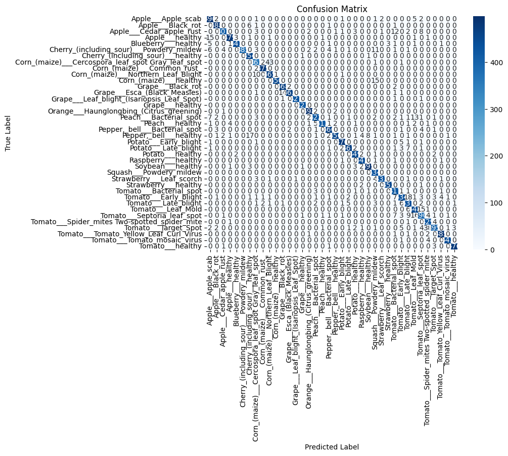

# Plant Disease Prediction Model

This repository contains a deep learning model for predicting plant diseases using a Convolutional Neural Network (CNN). The model is trained on the [New Plant Diseases Dataset](https://www.kaggle.com/vipoooool/new-plant-diseases-dataset) available on Kaggle.

## Table of Contents
- [Introduction](#introduction)
- [Dataset](#dataset)
- [Model Architecture](#model-architecture)
- [Training](#training)
- [Evaluation](#evaluation)
- [Usage](#usage)
- [Results](#results)
- [Installation & Requirements](#installation--requirements)
- [Download Model](#download-model)
- [License](#license)

## Introduction
The goal of this project is to develop a CNN model that can accurately classify images of plants into different disease categories. The model is trained on an augmented dataset containing images of healthy and diseased plants.

## Dataset
The dataset used in this project is the **New Plant Diseases Dataset** from Kaggle. It contains images of plants divided into training, validation, and test sets. The dataset is augmented to improve the model's generalization ability.

- **Training Set**: ~70% of the dataset, used to train the CNN model.
- **Validation Set**: ~15% of the dataset, used to tune hyperparameters and prevent overfitting.
- **Test Set**: ~15% of the dataset, used to evaluate the final model performance.

## Model Architecture
The CNN model consists of the following layers:
1. **Convolutional Layers**: Multiple layers with ReLU activation and max-pooling for feature extraction.
2. **Batch Normalization**: Applied to stabilize learning and improve convergence.
3. **Dropout Layers**: Added to prevent overfitting.
4. **Flatten Layer**: Converts the 2D feature maps into a 1D vector.
5. **Dense Layers**: Fully connected layers for classification.
6. **Output Layer**: Softmax activation for multi-class classification.

## Training
The model is trained using the Adam optimizer with a learning rate of 0.0001. The loss function used is categorical cross-entropy, and the model is trained for 10 epochs.

```python
import tensorflow as tf

cnn.compile(
    optimizer=tf.keras.optimizers.Adam(learning_rate=0.0001),
    loss='categorical_crossentropy',
    metrics=['accuracy']
)
training_history = cnn.fit(x=training_set, validation_data=validation_set, epochs=10)
```

## Evaluation
The model's performance is evaluated using accuracy, classification report, and confusion matrix.

```python
from sklearn.metrics import accuracy_score, classification_report, confusion_matrix
import seaborn as sns
import matplotlib.pyplot as plt

# Predict on test set
y_pred = model.predict(test_data)
y_pred_classes = y_pred.argmax(axis=1)

y_true = test_labels.argmax(axis=1)

# Compute accuracy
accuracy = accuracy_score(y_true, y_pred_classes)
print("Accuracy:", accuracy)
print(classification_report(y_true, y_pred_classes, target_names=class_names))

# Confusion Matrix
cm = confusion_matrix(y_true, y_pred_classes)
sns.heatmap(cm, annot=True, fmt='d', cmap='Blues', xticklabels=class_names, yticklabels=class_names)
plt.xlabel("Predicted")
plt.ylabel("Actual")
plt.title("Confusion Matrix")
plt.show()
```

## Usage
To use the trained model for predictions:
1. Load the model using TensorFlow.
2. Preprocess the input image to match the model's input shape (128x128 RGB).
3. Use the model to predict the class of the input image.

```python
import tensorflow as tf
import numpy as np
import cv2

def preprocess_image(image_path):
    image = cv2.imread(image_path)
    image = cv2.resize(image, (128, 128))
    image = image / 255.0  # Normalize pixel values
    image = np.expand_dims(image, axis=0)
    return image

model = tf.keras.models.load_model('plant-disease-prediction-model.h5')
image = preprocess_image('test_image.jpg')
predictions = model.predict(image)
print("Predicted Class:", np.argmax(predictions))
```

## Results
- **Training Accuracy**: The model achieves 98% accuracy on the training set.
- **Validation Accuracy**: The model generalizes well to the validation set, it also has the accuracy of 96%.
- **Confusion Matrix**: Visualized to understand the model's performance across different classes.



## Installation & Requirements
To set up the project locally, install the required dependencies using the following command:

```bash
pip install tensorflow numpy matplotlib opencv-python scikit-learn seaborn
```

## Download Model
The trained model can be downloaded using the following command in Google Colab:

```python
from google.colab import files
files.download('plant-disease-prediction-model.h5')
```

## License
This project is licensed under the MIT License. See the [LICENSE](LICENSE) file for details.

---

For any questions or issues, please open an issue in this repository.
